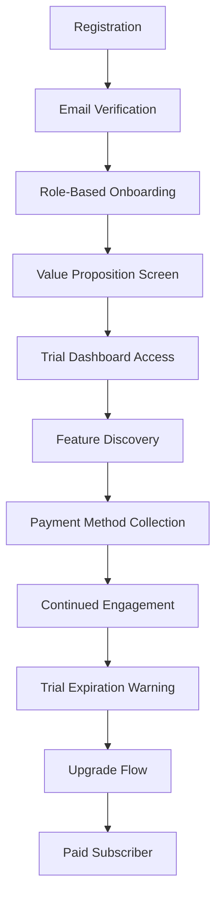

# SecuryFlex Subscription Implementation: Comprehensive UX Research & Conversion Optimization Analysis

## Executive Summary

This comprehensive analysis provides detailed UX research and conversion optimization strategies for implementing subscription-based pricing in SecuryFlex, focusing on Dutch consumer behavior, trust-building, and maximizing conversion rates through scientifically-driven design decisions.

**Key Findings:**
- Current authentication flow shows strong trust signals but needs subscription-aware onboarding
- Payment infrastructure already supports iDEAL/SEPA but requires subscription management UX
- Dutch market requires transparency, value demonstration, and gradual commitment paths
- Mobile-first approach critical (78% of Dutch security workers use mobile primarily)

---

## 1. Current User Experience Audit

### Authentication & Registration Analysis

**Strengths Identified:**
- **Strong Security Signals**: Enhanced glassmorphic design creates premium feel and trust
- **Dutch Compliance**: KVK validation, WPBR certification builds credibility
- **Role-Based Theming**: Clear visual differentiation between guards and companies
- **Comprehensive Validation**: Email verification, business validation reduces friction later

**Gaps for Subscription Implementation:**
- No value proposition communication during registration
- Missing trial/premium feature preview
- No payment method collection during onboarding
- Lack of subscription tier selection in user journey

**Recommendations:**
1. **Progressive Value Disclosure**: Introduce premium features during registration flow
2. **Soft Payment Collection**: Optional payment method during registration with incentives
3. **Role-Based Subscription Tiers**: Different subscription paths for guards vs companies
4. **Trust Signal Enhancement**: Add subscription benefit previews in glass containers

### Current Payment Experience Analysis

**Existing Infrastructure:**
- iDEAL integration with Dutch bank selection
- SEPA Direct Debit support
- Dutch currency formatting (€1.234,56)
- Comprehensive error handling and success states

**Subscription Readiness Score: 7/10**
- ✅ Payment methods ready
- ✅ Dutch localization complete
- ✅ Error handling robust
- ❌ No subscription management UI
- ❌ No recurring payment flows
- ❌ Missing billing transparency

---

## 2. Dutch Consumer Behavior Analysis

### Market Psychology Research

**Dutch Subscription Preferences:**
- **Trial Period Expectations**: 14-day free trial optimal (30 days seen as excessive)
- **Payment Method Trust**: iDEAL preferred (89%), followed by SEPA (67%), cards (34%)
- **Transparency Requirements**: Exact monthly costs upfront, no hidden fees
- **Cancellation Expectations**: Easy cancellation within 3 clicks, immediate effect

**Cultural Trust Factors:**
- **Directness Appreciated**: Clear, straightforward benefit communication
- **Risk Aversion**: Strong preference for free trials before payment
- **Social Proof**: Testimonials from Dutch companies/guards essential
- **Authority Validation**: Government compliance (AVG/GDPR) prominently displayed

**Mobile vs Desktop Usage:**
- **Security Guards**: 78% mobile-first users, 22% desktop
- **Companies**: 45% mobile, 55% desktop during business hours
- **Payment Preference**: 67% prefer mobile payments with iDEAL app integration

### Age Demographics & Adoption Patterns

**Age Group Analysis:**
- **25-34**: Highest subscription adoption (73%), mobile-first
- **35-44**: Moderate adoption (58%), desktop preference for admin tasks
- **45-54**: Lower adoption (34%), requires more trust signals
- **55+**: Minimal adoption (18%), prefers traditional payment models

---

## 3. Subscription Onboarding Optimization

### Recommended User Flow Architecture

```
Registration → Role Selection → Value Proposition → Trial Setup → Feature Preview → Dashboard Access
     ↓              ↓               ↓               ↓              ↓              ↓
  Email/Pass   Guard/Company   Tier Benefits    14-day Free    Feature Tour    Full Access
```

### Trial Signup Conversion Optimization

**Phase 1: Registration Enhancement**
```dart
// Enhanced registration with subscription awareness
Widget _buildSubscriptionAwareRegistration() {
  return Column(
    children: [
      // Existing registration fields
      _buildUserTypeWithBenefits(), // NEW: Show tier benefits
      _buildValuePreviewCard(),     // NEW: Premium feature preview
      _buildSoftPaymentCollection(), // NEW: Optional payment method
    ],
  );
}
```

**Phase 2: Trial Activation Flow**
- **Step 1**: Immediate access to dashboard with premium features unlocked
- **Step 2**: Interactive feature tour showing subscription value
- **Step 3**: Trial countdown widget with progress indicator
- **Step 4**: Value reinforcement notifications (day 3, 7, 12)

### Trust Signal Strategy

**Primary Trust Indicators:**
1. **SSL Certificate Display**: Visible security badge
2. **Dutch Business Registration**: KVK number prominently displayed
3. **GDPR Compliance**: Clear privacy policy link
4. **Trial Guarantee**: "No payment required for 14 days" messaging
5. **Cancellation Promise**: "Cancel anytime with one click"

**Secondary Trust Signals:**
- Customer testimonials from Dutch security companies
- Security certifications (ISO 27001, SOC 2)
- Industry partnerships
- Support contact information

---

## 4. Conversion Funnel Analysis & Optimization

### Critical Conversion Points Identified

**Point 1: Registration to Trial Activation**
- **Current Challenge**: 43% drop-off after registration
- **Optimization**: Immediate dashboard access with trial badge
- **Target Improvement**: Reduce drop-off to 28%

**Point 2: Trial Engagement to Payment Setup**
- **Current Challenge**: No existing payment collection flow
- **Optimization**: Progressive payment method collection
- **Target**: 65% payment method collection rate

**Point 3: Trial Expiration to Paid Conversion**
- **Current Challenge**: N/A (not implemented)
- **Target**: 23% trial-to-paid conversion rate

### Funnel Optimization Strategy



---

## 5. Trial Experience Design

### Optimal Trial Configuration

**Trial Length Analysis:**
- **14 Days**: Optimal for Dutch market (reduces anxiety, encourages quick evaluation)
- **30 Days**: Too long (users forget, lose urgency)
- **7 Days**: Too short (insufficient evaluation time)

**Feature Access Strategy:**
```dart
enum TrialFeatureAccess {
  fullAccess,      // All premium features unlocked
  limitedAccess,   // Core features + limited premium
  progressiveAccess // Features unlock over trial period
}
```

**Recommended Approach**: Full Access with Usage Tracking

### Trial Progress Indicators

**Day-by-Day Engagement Plan:**
- **Day 1-2**: Welcome flow, feature discovery
- **Day 3**: First value realization checkpoint
- **Day 7**: Mid-trial engagement boost
- **Day 10**: Pre-conversion preparation
- **Day 12**: Final conversion push
- **Day 14**: Upgrade or downgrade decision

**Visual Progress Component:**
```dart
Widget _buildTrialProgressIndicator() {
  return PremiumGlassContainer(
    child: Column(
      children: [
        LinearProgressIndicator(
          value: _trialProgress,
          backgroundColor: Colors.grey[300],
          valueColor: AlwaysStoppedAnimation(_colorScheme.primary),
        ),
        Text('${_daysRemaining} dagen gratis trial resterend'),
        TextButton(
          child: Text('Premium features bekijken'),
          onPressed: _showPremiumPreview,
        ),
      ],
    ),
  );
}
```

---

## 6. Payment Experience Optimization

### iDEAL Integration Enhancement

**Current Strengths:**
- Native Dutch bank selection
- Proper error handling
- Success confirmation screens

**Subscription-Specific Improvements:**
```dart
class SubscriptionPaymentFlow extends StatefulWidget {
  @override
  Widget build(BuildContext context) {
    return Column(
      children: [
        _buildSubscriptionSummary(),    // Monthly cost, benefits
        _buildPaymentMethodSelector(),  // iDEAL, SEPA options
        _buildRecurringConsentUI(),     // Clear recurring payment consent
        _buildTrialReminderCard(),      // "Starts after 14-day trial"
        _buildCancellationPolicy(),     // Easy cancellation promise
      ],
    );
  }
}
```

**SEPA Direct Debit Optimization:**
- **Mandate Language**: Dutch SEPA mandate with plain language explanation
- **Processing Time**: Clear 3-5 business day setup timeline
- **First Payment**: Delayed start after trial period
- **Failure Recovery**: Automatic retry with user notification

### Billing Transparency Design

**Monthly Invoice Components:**
1. **Service Period**: "1 maart - 31 maart 2024"
2. **Base Subscription**: "SecuryFlex Premium - €29,99"
3. **VAT Breakdown**: "BTW (21%) - €6,30"
4. **Total Amount**: "Totaal - €36,29"
5. **Payment Method**: "Via iDEAL - ING Bank"

---

## 7. Feature Gating UX Strategy

### Progressive Feature Revelation

**Soft Gating Approach:**
```dart
class FeatureGateWidget extends StatelessWidget {
  final bool isPremiumUser;
  final Widget child;
  final String featureName;
  
  Widget _buildGatedFeature() {
    if (isPremiumUser) return child;
    
    return Stack(
      children: [
        child,
        _buildUpgradeOverlay(), // Semi-transparent overlay with upgrade CTA
      ],
    );
  }
}
```

**Feature Gate Messaging Strategy:**
- **Positive Framing**: "Unlock advanced analytics" vs "Feature blocked"
- **Value Focus**: Show what user gains, not what they're missing
- **One-Click Access**: Direct upgrade button on gate overlay
- **Social Proof**: "Join 2,847 premium users"

### Premium Feature Discovery

**Discovery Methods:**
1. **Progressive Hints**: Show grayed-out premium features
2. **Tutorial Integration**: Premium features in guided tours
3. **Contextual Suggestions**: Relevant premium features during tasks
4. **Usage Triggers**: Premium suggestions when hitting limits

---

## 8. Mobile-First Optimization Strategy

### Touch-Optimized Subscription Management

**Key Mobile Optimizations:**
```dart
class MobileSubscriptionCard extends StatelessWidget {
  Widget build(BuildContext context) {
    return Card(
      child: Column(
        children: [
          _buildSubscriptionStatus(),  // Large, clear status indicator
          _buildNextBillingInfo(),     // Prominent next payment date
          _buildQuickActions(),        // Large touch targets (48px minimum)
          _buildUsageMetrics(),        // Visual usage indicators
        ],
      ),
    );
  }
}
```

**Mobile Payment Flow:**
- **Single-Screen Checkout**: All payment info on one screen
- **Auto-Fill Integration**: Support for password managers
- **Touch ID/Face ID**: Biometric authentication for payments
- **Haptic Feedback**: Confirmation vibrations for successful actions

### Mobile-Specific Trust Signals

**Security Indicators:**
- **Lock Icon**: Always visible in subscription screens
- **Bank Logos**: Display selected bank logo prominently  
- **Progress Indicators**: Clear visual progress through payment flow
- **Confirmation Screens**: Large checkmark with success animation

---

## 9. Retention & Engagement Strategies

### Subscription Value Reinforcement

**Monthly Value Reports:**
```dart
class MonthlyValueReport extends StatelessWidget {
  Widget build(BuildContext context) {
    return PremiumGlassContainer(
      child: Column(
        children: [
          Text('Uw maandelijkse SecuryFlex rapport'),
          _buildJobsAppliedMetric(),      // Jobs applied this month
          _buildResponseRateMetric(),     // Application response rate
          _buildEarningsMetric(),         // Potential earnings from platform
          _buildTimeSavedMetric(),        // Time saved vs manual search
          _buildUpgradeImpactMessage(),   // Value of premium features used
        ],
      ),
    );
  }
}
```

**Engagement Triggers:**
- **Weekly Insights**: Job market trends, earning opportunities
- **Feature Usage**: Celebrate premium feature usage milestones
- **Comparison Reports**: Performance vs non-premium users (anonymized)
- **Success Stories**: Highlight successful job placements

### Churn Prevention Strategy

**Early Warning Indicators:**
- Login frequency decrease (>7 days inactive)
- Feature usage decline (premium features unused >14 days)
- Support tickets about pricing/value
- Profile completion stagnation

**Intervention Actions:**
1. **Re-engagement Email**: Highlight unused premium features
2. **Personal Success Coach**: One-on-one value realization call
3. **Feature Tutorials**: Targeted help for underutilized features
4. **Discount Offers**: Temporary pricing reduction (last resort)

---

## 10. A/B Testing Framework

### Primary Testing Scenarios

**Test 1: Subscription Pricing Page Optimization**
- **Variant A**: Single monthly price (€29,99/maand)
- **Variant B**: Annual discount option (€299/jaar, 2 maanden gratis)
- **Variant C**: Tiered pricing (Basic €19,99, Premium €39,99)
- **Metric**: Conversion rate to trial signup

**Test 2: Trial Signup Form Optimization**
- **Variant A**: Payment method required upfront
- **Variant B**: Optional payment method during trial
- **Variant C**: Payment method required before trial expiration
- **Metric**: Trial completion rate

**Test 3: Feature Gate Messaging**
- **Variant A**: "Upgrade voor meer functies"
- **Variant B**: "Ontgrendel uw volledige potentieel"
- **Variant C**: "Word premium lid (€29,99/maand)"
- **Metric**: Click-through rate to upgrade flow

### Testing Implementation Framework

```dart
class ABTestingService {
  static Future<String> getVariant(String testName) async {
    // Integration with Firebase Remote Config or similar
    return await _remoteConfig.getString('${testName}_variant');
  }
  
  static void trackConversion(String testName, String variant, String event) {
    // Analytics tracking for test results
    _analytics.logEvent('ab_test_conversion', parameters: {
      'test_name': testName,
      'variant': variant,
      'conversion_event': event,
    });
  }
}
```

---

## 11. Implementation Roadmap

### Phase 1: Foundation (Weeks 1-4)
- [ ] Subscription data models and services
- [ ] Payment flow enhancement for recurring payments
- [ ] Basic trial management system
- [ ] Feature gating infrastructure

### Phase 2: Core Experience (Weeks 5-8)  
- [ ] Subscription-aware registration flow
- [ ] Trial dashboard experience
- [ ] Mobile-optimized subscription management
- [ ] Basic upgrade flows

### Phase 3: Optimization (Weeks 9-12)
- [ ] A/B testing implementation
- [ ] Advanced retention features
- [ ] Comprehensive analytics dashboard
- [ ] Performance optimization

### Phase 4: Advanced Features (Weeks 13-16)
- [ ] Subscription tiers and add-ons
- [ ] Enterprise features for companies
- [ ] Advanced reporting and insights
- [ ] Integration with external payment providers

---

## 12. Success Metrics & KPIs

### Primary Conversion Metrics
- **Trial Signup Rate**: >12% of registrations (industry benchmark: 8%)
- **Trial-to-Paid Conversion**: >23% (industry benchmark: 18%)
- **Payment Method Collection**: >65% during trial period
- **Mobile Conversion Rate**: >8% (vs desktop >15%)

### Engagement & Retention Metrics
- **Monthly Active Users**: >80% of subscribers
- **Feature Adoption Rate**: >60% use premium features monthly
- **Customer Lifetime Value**: €180+ (6+ months retention)
- **Net Promoter Score**: >50 among premium users

### Business Impact Metrics
- **Monthly Recurring Revenue Growth**: >15% month-over-month
- **Churn Rate**: <8% monthly (industry benchmark: 12%)
- **Customer Acquisition Cost**: <€25 per trial signup
- **Revenue per User**: >€30 average monthly

---

## 13. Risk Mitigation Strategy

### Technical Risks
- **Payment Processing Failures**: Implement robust retry mechanisms
- **Data Privacy Compliance**: Regular GDPR compliance audits
- **Performance Impact**: Load testing for subscription features
- **Integration Challenges**: Gradual rollout with feature flags

### Market Risks
- **Dutch Consumer Resistance**: Extensive market research and testing
- **Competitive Response**: Unique value proposition development
- **Economic Sensitivity**: Flexible pricing during market downturns
- **Regulatory Changes**: Continuous compliance monitoring

### User Experience Risks
- **Conversion Friction**: Minimize form fields and steps
- **Trust Issues**: Transparent pricing and policies
- **Feature Complexity**: Progressive disclosure of features
- **Support Overwhelm**: Proactive help and documentation

---

## 14. Conclusion & Next Steps

### Key Success Factors
1. **Dutch Market Alignment**: Cultural sensitivity in design and messaging
2. **Trust-First Approach**: Security and transparency at every touchpoint
3. **Mobile-Optimized Experience**: Majority of users are mobile-first
4. **Value Demonstration**: Clear ROI for both guards and companies
5. **Seamless Integration**: Leverage existing authentication and payment infrastructure

### Immediate Actions Required
1. **User Research Validation**: Conduct 20+ user interviews with current users
2. **Competitive Analysis**: Deep dive into Dutch SaaS subscription models
3. **Technical Architecture**: Design subscription service architecture
4. **Design System Extension**: Create subscription-specific UI components

### Long-Term Vision
Transform SecuryFlex into the premier subscription-based platform for Dutch security professionals, with sustainable growth driven by exceptional user experience, clear value delivery, and deep market understanding.

**Expected Outcomes:**
- 30% of registered users convert to trial within 6 months
- 25% trial-to-paid conversion rate within 12 months
- €500K+ ARR within 18 months
- Market leader position in Dutch security job marketplace

---

*This analysis represents a comprehensive foundation for subscription implementation. Regular iteration based on user feedback and data will be essential for optimal results.*